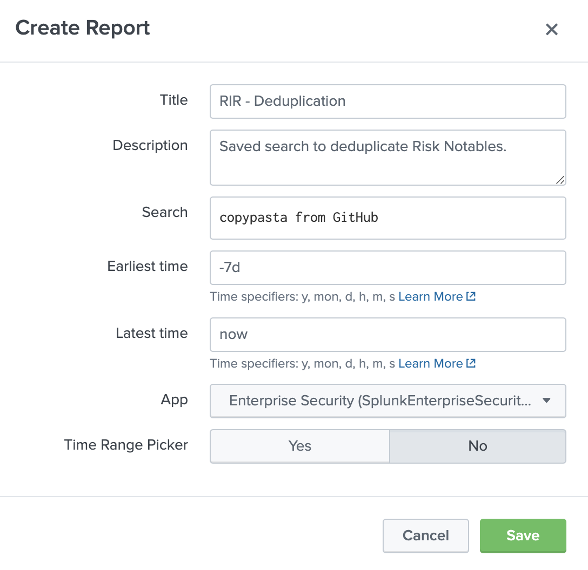
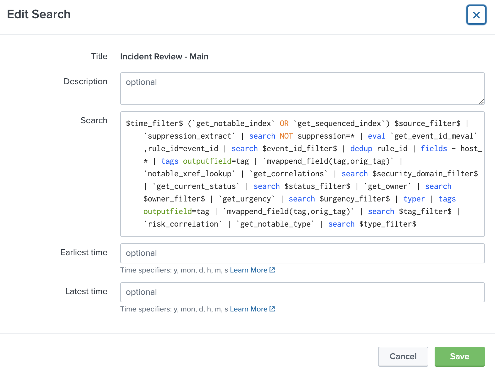
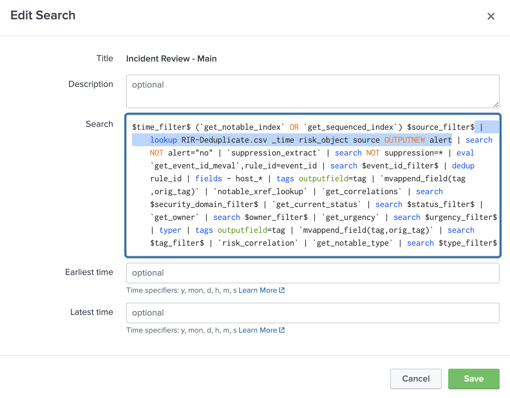
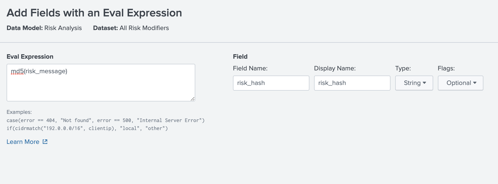

# Deduplicate Notable Events

!!! abstract "Throttle Alerts Which Have Already Been Reviewed or Fired"

Because Risk Notables look at a period of time, it is common for a risk_object to keep creating notables as additional (and even duplicate) events roll in, as well as when events fall off as the time period moves forward. Additionally, different Risk Incident Rules could be firing on the same risk_object with the same events but new Risk Notables. It is difficult to get around this with throttling, so we'll be using a Saved Search to store each Risk Notable's risk events and the analyst's status decision as a cross-reference for new notables and decide whether to create a new alert.

!!! tip "KEEP IN MIND"

    Edits to the **Incident Review - Main** search ***may*** be replaced on updates to Enterprise Security; requiring you to make this minor edit again to regain this functionality. Ensure you have a step in your relevant process to check this search after an update.

## Making It Happen :hammer:

### 1. Create a Truth Table

This method is described in [Stuart McIntosh's 2019 .conf Talk](https://conf.splunk.com/files/2019/recordings/SEC1908.mp4){ target=_blank } (about 9m10s in), and we're going to create a similar [lookup table](https://github.com/splunk/rba/blob/main/lookups/RIR-Truth-Table.csv){ target=_blank }. You can either download and import that file yourself, or create something like this in the [Lookup Editor app](https://splunkbase.splunk.com/app/1724){ target=_blank }:

<figure markdown>
  
  <figcaption>Truth Table</figcaption>
</figure>

### 2. Create a Saved Search

Then we'll create a Saved Search which runs relatively frequently to store notable data and statuses.

1. Navigate to Settings -> Searches, reports, and alerts.
1. Select "New Report" in the top right.

!!! quote ""
    Here is a sample to replicate

<figure markdown>
  
  <figcaption>Sample Report</figcaption>
</figure>

``` shell title="With this SPL" linenums="1" hl_lines="19"
index=notable eventtype=risk_notables
| eval indexer_guid=replace(_bkt,".*~(.+)","\1"),event_hash=md5(_time._raw),event_id=indexer_guid."@@".index."@@".event_hash
| fields _time event_hash event_id risk_object risk_score source orig_source
| eval temp_time=time()+86400
| lookup update=true event_time_field=temp_time incident_review_lookup rule_id AS event_id OUTPUT status as new_status
| lookup update=true correlationsearches_lookup _key as source OUTPUTNEW default_status
| eval status=case(isnotnull(new_status),new_status,isnotnull(status),status,1==1,default_status)
| fields - temp_time,new_status,default_status
| eval temp_status=if(isnull(status),-1,status)
| lookup update=true reviewstatuses_lookup _key as temp_status OUTPUT status,label as status_label
| fields - temp_status
| eval sources = if(isnull(sources) , orig_source , sources )
| table _time event_hash risk_object source status_label sources risk_score
| reverse
| streamstats current=f window=0 latest(event_hash) as previous_event_hash values(*) as previous_* by risk_object
| eval previousNotable=if(isnotnull(previous_event_hash) , "T" , "F" )
| fillnull value="unknown" previous_event_hash previous_status_label previous_sources previous_risk_score
| eval matchScore = if( risk_score != previous_risk_score , "F" , "T" )
| eval {==previousStatus==} = case( match(previous_status_label, "(Closed)") , "nonmalicious" , match(previous_status_label, "(New|Resolved)") , "malicious" , true() , "malicious" )
# (1)!
| mvexpand sources
| eval matchRR = if(sources != previous_sources , "F", "T")
| stats  dc(sources) as dcSources dc(matchRR) as sourceCheckFlag values(*) as * by _time risk_object event_hash
| eval matchRR = if(sourceCheckFlag > 1 , "F" , matchRR )
| lookup RIR-Truth-Table.csv previousNotable previousStatus matchRR matchScore OUTPUT alert
| table _time risk_object source risk_score event_hash dcSources alert previousNotable previousStatus matchRR matchScore
| outputlookup RIR-Deduplicate.csv
```

1. `previousStatus` uses the default ES status label "Closed".

In the SPL for `previousStatus` above, I used the default ES status label "Closed" as our only nonmalicious status. You'll have to make sure to use status labels which are relevant for your Incident Review settings. "Malicious" is used as the fallback status just in case, but you may want to differentiate "New" or unmatched statuses as something else for audit purposes; just make sure to create relevant matches in your truth table.

!!! tip "I recommend copying the alert column from malicious events"

#### Schedule the Saved Search

``` markdown title="Create schedule"
    Now find the search in this menu, click *Edit -> Edit Schedule* and try these settings:
```

<div class="result" markdown>

{ align=right width=650 }

- **Schedule:** Run on Cron Schedule
- **Cron Expression:** `*/3 * * * *`
- **Time Range:** Last 7 days
- **Schedule Priority:** Highest
- **Schedule Window:** No window

</div>

I made this search pretty lean, so running it every three minutes should work pretty well; I also decided to only look back seven days as this lookup could balloon in size and cause bundle replication issues. You probably want to stagger your Risk Incident Rule cron schedules by one minute more than this one so they don't fire on the same risk_object with the same risk events.

### 3. Deduplicate notables

Our last step is to ensure that the Incident Review panel doesn't show us notables when we've found a match to our truth table which doesn't make sense to alert on. In the *Searches, reports, alerts* page, find the search **Incident Review - Main** and click Edit -> Edit Search.

!!! quote ""
    By default it looks like this:

<figrue markdown>
  
  <figcaption>Default incident review search</figcaption>
</figure>

!!! note "And we're just inserting this line after the base search"

    ```shell title="Append to the base search" linenums="1"
    ...
    | lookup RIR-Deduplicate.csv _time risk_object source OUTPUTNEW alert
    | search NOT alert="no"
    ```

<figure markdown>
  
  <figcaption>Updated incident review search</figcaption>
</figure>

## Congratulations! :partying_face:

You should now have a significant reduction in duplicate notables

If something isn't working, make sure that the Saved Search is correctly outputting a lookup (which should have Global permissions), and ensure if you `| inputlookup RIR-Deduplicate.csv` you see all of the fields being returned as expected. If Incident Review is not working, something is wrong with the lookup or your edit to that search.

---

## Extra Credit

If you utilize the [Risk info field](./risk_info_event_detail.md) so you have a short and sweet risk_message, you can add another level of granularity to your truth table.

!!! tip "if you utilize risk_message for ALL of the event detail, it may be *too* granular and isn't as helpful for throttling."

This is especially useful if you are creating risk events from a data source with its own signatures like EDR, IDS, or DLP. Because the initial truth table only looks at score and correlation rule, if you have one correlation rule importing numerous signatures, you may want to alert when a new signature within that source fires.

### Create a calculated field

First, we'll create a new Calculated Field from risk_message in our Risk Datamodel called risk_hash with eval's `md5()` function, which bypasses the need to deal with special characters or other strangeness that might be in that field. If you haven't done this before - no worries - you just have to go to *Settings -> Data Models -> Risk Data Model -> Edit -> Edit Acceleration* and turn this off. Afterwards, you can *Create New -> Eval Expression* like this:

<figure markdown>
  
  <figcaption>Creating risk_hash from md5(risk_message) in data model</figcaption>
</figure>

???+ danger "Don't forget to re-enable the acceleration"
    You may have to rebuild the data model from the **Settings -> Data Model** menu for this field to appear in your events.

### Update SPL

Then we have to add this field into our Risk Incident Rules by adding this line to their initial SPL and ensure this field is retained downstream:

``` shell title="Field to add to RiR"
values(All_Risk.risk_hash) as risk_hashes
```

Now our Risk Notables will have a multi-value list of `risk_message` hashes. We must update our truth table to include a field called "matchHashes" - I've created a sample truth table [here](https://github.com/splunk/rba/blob/main/lookups/RIR-Truth-Table-Hashes.csv){ target=_blank }, but you must decide what is the proper risk appetite for your organization.

Next we'll edit the Saved Search we created above to include the new fields and logic:

``` shell title="Updated logic (changes highlighted)" linenums="1" hl_lines="10-13"
...
| eval sources = if(isnull(sources) , orig_source , sources )
| table _time event_hash risk_object source status_label sources risk_score {==risk_hashes==}
| reverse
| streamstats current=f window=0 latest(event_hash) as previous_event_hash values(*) as previous_* by risk_object
| eval previousNotable=if(isnotnull(previous_event_hash) , "T" , "F" )
| fillnull value="unknown" previous_event_hash previous_status_label previous_sources previous_risk_score {==previous_risk_hashes==}
| eval matchScore = if( risk_score != previous_risk_score , "F" , "T" )
| eval previousStatus = case( match(previous_status_label, "(Closed)") , "nonmalicious" , match(previous_status_label, "(New|Resolved)") , "malicious" , true() , "malicious" )
| mvexpand risk_hashes
| eval matchHashes= if(risk_hashes != previous_risk_hashes , "F" , "T" )
| stats dc(matchHashes) as hashCheckFlag values(*) as * by _time risk_object event_hash
| eval matchHashes = if(hashCheckFlag > 1 , "F" , matchHashes )
| mvexpand sources
| eval matchRR = if(sources != previous_sources , "F", "T")
| stats  dc(sources) as dcSources dc(matchRR) as sourceCheckFlag values(*) as * by _time risk_object event_hash
| eval matchRR = if(sourceCheckFlag > 1 , "F" , matchRR )
| lookup RIR-Truth-Table.csv previousNotable previousStatus matchRR matchScore {==matchHashes==} OUTPUT alert
| table _time risk_object source risk_score event_hash dcSources alert previousNotable previousStatus matchRR matchScore {==matchHashes==}
| outputlookup RIR-Deduplicate.csv
```

Voila! We now ensure that our signature-based risk rule data sources will properly alert if there are interesting new events for that risk object.
